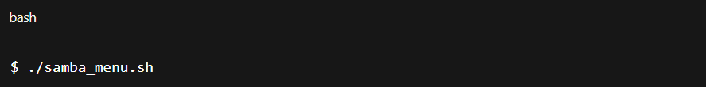

// ...existing code...
# 🖥️ Instalador y gestor de Samba

Hola, soy **Álvaro** 👋  
He hecho este pequeño programa en **Bash** para poder **instalar, configurar y administrar el servicio Samba** tanto de forma local como remota.  
El script también permite gestionarlo con **comandos**, **Ansible** o **Docker**, todo desde un menú interactivo.

---

## 📋 Requisitos previos

Antes de ejecutar el script asegúrate de tener:

- Un sistema Linux basado en Debian/Ubuntu.  
- `bash`, `ssh`, `sudo` y `systemctl` instalados.  
- Acceso de administrador (`sudo`) en el equipo local o remoto.  
- Si usas las opciones con Ansible o Docker, tenerlos instalados.

---

## ⚙️ Ejecución del script

Guarda el archivo como `samba_menu.sh` y dale permisos de ejecución:

```bash
chmod +x samba_menu.sh
```

Ejecuta el programa:

```bash
./samba_menu.sh
```

---

## 🧭 Menú principal

El programa mostrará el siguiente menú:

- a. Mostrar datos de tu equipo  
- b. Mostrar el estado del servicio  
- c. Mostrar un menú para ejecutar acciones  
- d. Salir

📸 Captura:  


---

## 🖧 Opción a – Mostrar datos de red

Muestra las direcciones IP detectadas del equipo.

📸 Captura:  


---

## 🧩 Opción b – Estado del servicio

Muestra si el servicio Samba (smbd) está activo o detenido.

📸 Captura:  


---

## ⚙️ Opción c – Menú de acciones

Permite gestionar Samba de distintas formas:

1. Instalación del servicio  
2. Eliminar el servicio  
3. Activar el servicio  
4. Parar el servicio  
5. Salir

📸 Captura:  


---

## 🛠️ Instalación del servicio (Opción 1)

Inicia una configuración interactiva de Samba donde se definen:

- Usuario  
- Contraseña  
- IP  
- Grupo de trabajo  
- NetBIOS  
- Descripción del servidor  
- Carpeta compartida

📸 Captura:  


### 🚀 Elección del método de instalación

Una vez configurado Samba, puedes elegir cómo instalarlo:

- a. Instalar con comandos  
- b. Instalar con Ansible  
- c. Instalar con Docker  
- d. Cancelar

📸 Captura general:  


#### 🔹 Opción a – Instalación con comandos
Realiza la instalación vía SSH ejecutando `apt update`, `apt install samba` y muestra el estado del servicio.

📸 Captura:  


#### 🔹 Opción b – Instalación con Ansible
Genera un archivo hosts y lanza un playbook de Ansible para automatizar la instalación.

📸 Captura:  


#### 🔹 Opción c – Instalación con Docker
Construye una imagen de Docker con Samba instalado y ejecuta un contenedor con los puertos SMB expuestos.

📸 Captura:  


---

## 🧯 Parar el servicio

Permite detener el servicio Samba en un equipo remoto mediante SSH.

📸 Captura:  


---

## 🚪 Salida del programa

Para cerrar el script, basta con elegir la opción `d` en el menú principal o `5` en el menú de acciones.

📸 Captura:  


---

## 🗺️ Diagrama / plano general

📸 Captura:  


---

## 🧾 Autor

Desarrollado por: Álvaro

Proyecto realizado como práctica de administración de servicios de red (Samba).

✨ Gracias por ver este proyecto. ¡Puedes probarlo, adaptarlo o mejorarlo!
